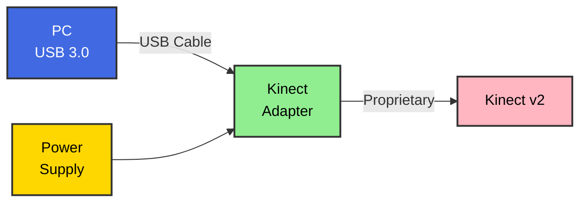

# OpenKinect v2

Complete Xbox Kinect v2 support for Linux - camera, audio, and everything in between.

## 🎯 What This Project Does

This project provides **complete Linux support** for Xbox Kinect v2, filling the gaps left by existing drivers:

- ✅ **Easy webcam setup** - Works with Zoom, Teams, OBS out-of-the-box
- ✅ **Software beamforming** - Directional audio with the 4-mic array
- ✅ **Audio enhancement** - Noise suppression, gain control, voice focus
- ✅ **Simple installation** - One-command setup with systemd integration
- ✅ **Real-time processing** - Low latency for video calls and streaming

## 🚀 Quick Start

```bash
# Clone and install
git clone https://github.com/BenGWeeks/openkinect-v2.git
cd openkinect-v2
./install.sh
```

On Bazzite, `./install.sh` can be launched from the host or from a distrobox/dev container. If RPM Fusion is not already enabled, the first run stages the RPM Fusion release packages and asks for a reboot. A second run may then stage the remaining host packages and ask for one more reboot. The final run builds `libfreenect2`, installs the host service, and starts the default RGB webcam stream.

After install, the host service is ready immediately. The browser-based control panel can be launched directly from the repo with `python3 packaging/flatpak/openkinect-control.py`. If you also build and install the Flatpak control app, `flatpak run org.openkinect.OpenKinectV2` launches the same control panel. It defaults to `http://127.0.0.1:40123/`, opens your browser automatically, and exposes stream-mode switching plus a three-stop live depth palette editor for near, middle, and far colors. If `40123` is already in use, the app falls back to another local port and prints the active URL.

## 📸 Camera Features

- **1080p video** at 30fps
- **Direct V4L2 output** - no CPU-heavy conversions
- **Automatic service** - starts on boot
- **Works everywhere** - Zoom, Teams, Chrome, Firefox, OBS

## 🎙️ Audio Features

### Current (Basic USB Audio)
- 4-channel raw audio capture
- Very quiet (-20dB vs Windows)
- No directional processing

### Coming Soon (Software Beamforming)
- **Directional audio** - focus on speaker, reject noise
- **Auto gain** - normalizes quiet Kinect audio
- **Noise suppression** - reduces background sounds
- **Voice tracking** - follows active speaker
- **Low latency** - <20ms processing delay

## 📋 Requirements

### Hardware Setup



### Hardware Requirements
- Xbox Kinect v2 (Xbox One version)
- Official Kinect Adapter for Windows (provides power)
- USB 3.0 port (blue port, rear panel preferred)

### Software
- Linux kernel 4.4+ (Ubuntu 20.04+ recommended)
- libfreenect2
- v4l2loopback
- JACK audio (for beamforming)

## 📦 Bazzite Packaging

For immutable Bazzite systems, use the host companion package plus the minimal Flatpak launcher described in [docs/BAZZITE.md](docs/BAZZITE.md).

- Host package: installs `openkinect-v2d`, the systemd service, and audio helper scripts
- Flatpak control app: launches a browser-based host control panel and still forwards CLI commands through the host bridge
- Streams are discovered by labels (`Kinect_Color`, `Kinect_IR`, `Kinect_Depth`) instead of fixed device numbers

## 🔧 Installation

```bash
# Clone repository
git clone https://github.com/BenGWeeks/openkinect-v2.git
cd openkinect-v2

# Run the Bazzite/Fedora-aware installer
./install.sh
```

On current Bazzite systems the installer may need multiple runs because `rpm-ostree` applies repository and package layering through new deployments. On supported hosts, the Bazzite bootstrap now prefers an OpenCL-enabled `libfreenect2` build for depth processing. See [docs/BAZZITE.md](docs/BAZZITE.md) for the host flow.

## 🕹️ Control Panel

The control panel is a local browser UI for the Bazzite host service.

Launch it from the packaged control app if you have built and installed the Flatpak locally:

```bash
flatpak run org.openkinect.OpenKinectV2
```

Launch it directly from the repo in a dev container or shell:

```bash
python3 packaging/flatpak/openkinect-control.py
```

By default it listens on:

```text
http://127.0.0.1:40123/
```

If that port is busy, the app falls back to another local port and prints the URL to the terminal.

Current controls:

- Stream mode switching: `color`, `ir`, `depth`, or `all`
- Live depth palette editing for `near`, `middle`, and `far` colors
- Host service status display
- Manual service restart

Mode changes restart the service. Depth palette changes are applied live through the host control script without a full restart.

## 📁 Project Structure

```
openkinect-v2/
├── camera/          # Webcam functionality
├── audio/           # Beamforming and audio processing
├── scripts/         # Installation and utilities
├── services/        # Systemd integration
├── docs/            # Documentation
└── examples/        # Usage examples
```

## 🎯 Why This Project?

Existing Kinect v2 Linux support is fragmented:
- **libfreenect2** - Great for developers, but no easy webcam setup
- **No audio processing** - Microphone array potential wasted
- **Complex setup** - Multiple manual steps required
- **No integration** - Doesn't "just work" with apps

This project brings it all together in one easy-to-use package.

## 🚧 Development Status

### ✅ Completed
- Camera as V4L2 webcam device
- Systemd service integration
- Basic audio capture
- Installation scripts
- Live depth palette control

### 🔄 In Progress
- Software beamforming implementation
- Audio enhancement pipeline
- Control panel expansion

### 📋 Planned
- Depth camera access
- Skeletal tracking
- ROS integration
- Further GPU acceleration and fallback tuning

## 🤝 Contributing

Contributions welcome! See [CONTRIBUTING.md](CONTRIBUTING.md) for guidelines.

Areas we need help:
- Testing on different Linux distributions
- Optimizing beamforming algorithms
- Documentation and tutorials
- GUI development

## 📚 Documentation

- [Installation Guide](docs/INSTALL.md)
- [Camera Setup](docs/CAMERA.md)
- [Audio Processing](docs/AUDIO.md)
- [Depth Performance Roadmap](docs/DEPTH-PERFORMANCE-ROADMAP.md)
- [Troubleshooting](docs/TROUBLESHOOTING.md)
- [Technical Details](docs/TECHNICAL.md)

## 🔗 Related Projects

- [libfreenect2](https://github.com/OpenKinect/libfreenect2) - Core Kinect v2 driver
- [pyroomacoustics](https://github.com/LCAV/pyroomacoustics) - Beamforming algorithms
- [v4l2loopback](https://github.com/umlaeute/v4l2loopback) - Virtual camera support

## 📄 License

MIT License - see [LICENSE](LICENSE) for details.

## 🙏 Acknowledgments

- OpenKinect community for libfreenect2
- Linux audio/video community
- Everyone who's struggled with Kinect on Linux

---

**Note**: This project is not affiliated with Microsoft. Kinect is a trademark of Microsoft Corporation.